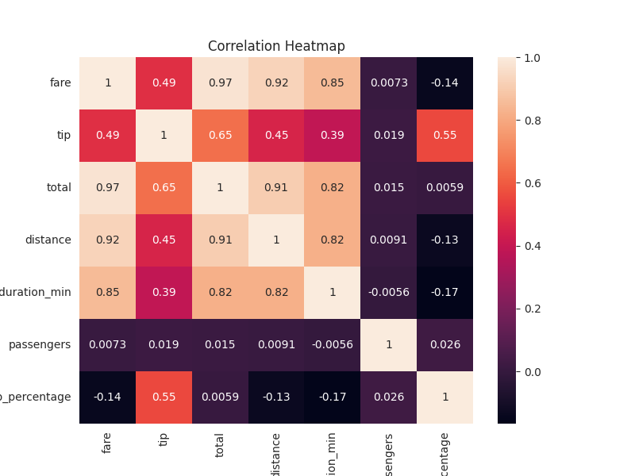

# Taxi Trip Revenue Analysis

A data analysis project exploring taxi revenue patterns using Python.

## Key Insight
The heatmap shows strong relationships between fare, total revenue, and trip distance, indicating that longer trips drive higher revenue.

## Visualization

## Tools
- Python
- pandas
- seaborn
- matplotlib
